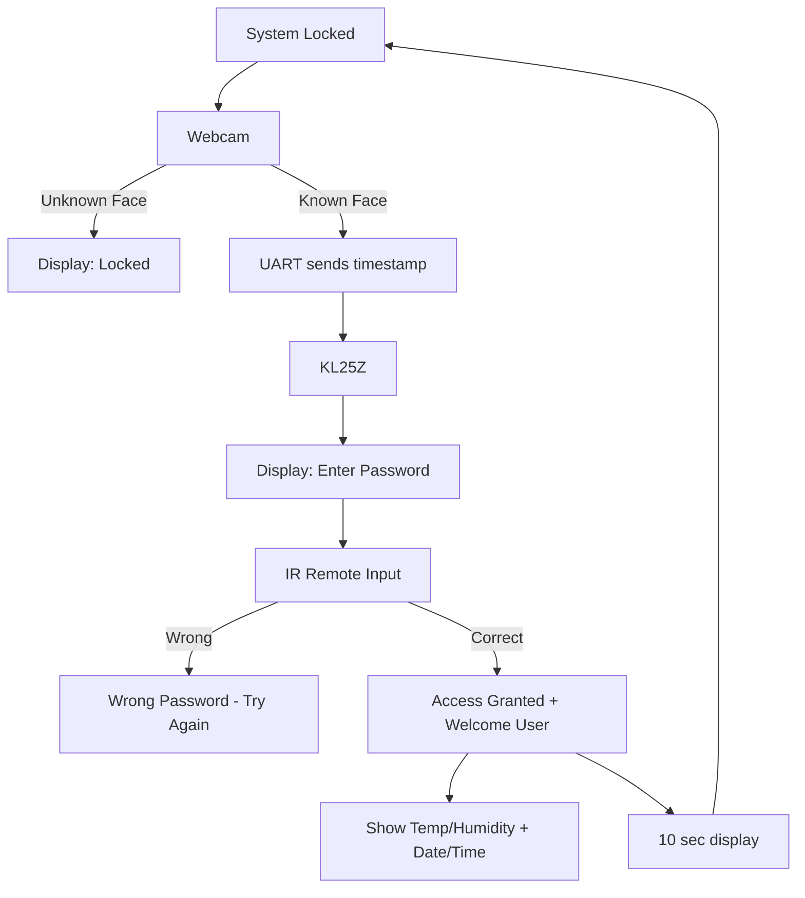

# Remote Access Terminal – Dual Authentication Embedded System

[]()
[]()
[]()

---

## 🔹 Overview
This project implements a **dual-layer access control system** that combines **biometric face recognition** with a **4-digit IR remote password**.  
It integrates a **Python application** (for face recognition and logging) with **embedded C firmware** running on the NXP **KL25Z** microcontroller.  

- **Layer 1 – Face Recognition (Python):** Webcam detects and identifies known users.  
- **Layer 2 – IR Remote Password (Embedded C):** After recognition, the system requests a 4-digit IR password via an NEC-protocol remote.  

Only when **both layers are satisfied** does the system grant access, display user information on the LCD, and log the event into a database.  

---

## 🔹 Demo Video
[](https://www.youtube.com/watch?v=SDRZgKXv4Wg&t)


## 🔹 Features

### 🖥️ Face Recognition (Python)
- Real-time face recognition using the `face_recognition` library and OpenCV.  
- Sends **timestamp + recognition result** to KL25Z via UART.  
- If unknown face detected → sends code `0`, system stays locked.  
- Each recognition attempt is logged in **SQLite3** database (`access_logs.db`).  

### ⚙️ KL25Z Embedded System
- **LCD (20x4, I²C):** Displays status messages, user greetings, date/time, temperature and humidity.  
- **IR Remote Receiver (NEC protocol):**  
  - Captures signal edges to decode binary values.  
  - Validates a **4-digit password** (default: `1668`).  
  - Wrong attempts show *Wrong Password – Try Again*.  
- **DHT11 Sensor:** Provides live temperature and humidity readings.  
- **Access Timing:**  
  - After correct password → *Access Granted* for **10 seconds**, then system auto-locks.  

### 📊 Database Utilities
- `sqlite_items.py` → View all database logs (ID, user, timestamp).  
- `sqlite_delete.py` → Clear all log entries.  

---

## 🔹 System Workflow



---

## 🔹 Project Structure

```
Remote-Access-Terminal/
│── embedded/        # KL25Z firmware
│   ├── main.c
│   ├── MainFile.c
│   ├── MainFile.h
│   ├── LCD.c
│   ├── LCD.h
│   ├── IRremote.c
│   ├── IRremote.h
│   ├── temp_mois.c
│   ├── temp_mois.h
│
│── python/          # Face recognition + database scripts
│   ├── face_recognition_212Project.py
│   ├── sqlite_items.py
│   ├── sqlite_delete.py
│   ├── access_logs.db   (ignored if sensitive)
│
│── README.md
│── .gitignore
```

---

## 🔹 Hardware Requirements
- **Board:** NXP KL25Z (ARM Cortex-M0+)  
- **Peripherals:**  
  - LCD 20x4 (I²C communication)  
  - IR Remote + Receiver (NEC protocol)  
  - DHT11 Sensor (temperature & humidity)  

---

## 🔹 Software Requirements

### Embedded Side
- Toolchain: Keil uVision / MCUXpresso / GCC ARM Embedded  
- C source files (modular structure)  

### Python Side
- Python 3.8+  
- Required libraries:  
  ```bash
  pip install face_recognition opencv-python numpy pyserial
  ```
- SQLite (included in Python standard library)  

---

## 🔹 Usage

### 1. Embedded Side
1. Flash the `embedded/` firmware onto the KL25Z.  
2. Connect LCD, IR receiver, and DHT11 sensor.  

### 2. Python Side
1. Place known face images (`me.jpg`, `friend.jpg`, etc.) in the same folder.  
2. Run the main script:  
   ```bash
   python face_recognition_212Project.py
   ```  
3. The program will open a webcam window for live detection.  
4. Press **Q** to quit.  

### 3. Access Flow
- Unknown face → LCD stays *Locked*.  
- Known face → UART sends timestamp → LCD: *Enter Password*.  
- Wrong IR password → *Wrong Password*.  
- Correct password → *Access Granted* + LCD shows:  
  - **Welcome message**  
  - **Date & time**  
  - **Temperature & humidity**  
- After 10 seconds → system relocks.  

### 4. Logs
- View logs:  
  ```bash
  python sqlite_items.py
  ```  
- Delete logs:  
  ```bash
  python sqlite_delete.py
  ```  

---

## 🔹 Future Improvements
- Add **EEPROM/RTC** for offline logging when Python app is disconnected.  
- Create a **web-based dashboard** for remote log monitoring.  
- Expand IR remote functionality with menu navigation.  
- Support **wireless communication (Wi-Fi/MQTT)** for IoT integration.  

---

## 🔹 Demo Scenario

1. System starts with *Locked* message on LCD.  
2. An unknown user appears → LCD still shows *Locked*.  
3. The rightful user appears → Face recognized, timestamp sent via UART.  
4. LCD shows *Enter Password*.  
5. User enters wrong password → *Wrong Password – Try Again*.  
6. User enters correct password (`1668`) → *Access Granted*.  
7. LCD displays:  
   - Welcome message with username  
   - Date & Time (from Python)  
   - Temperature & Humidity (from DHT11)  
8. After 10 seconds → system relocks, loop restarts.  

---

## 🔹 Author
Developed by **Ulaş Sakın**  
2025 – E212 Embedded Systems + Computer Vision Project
